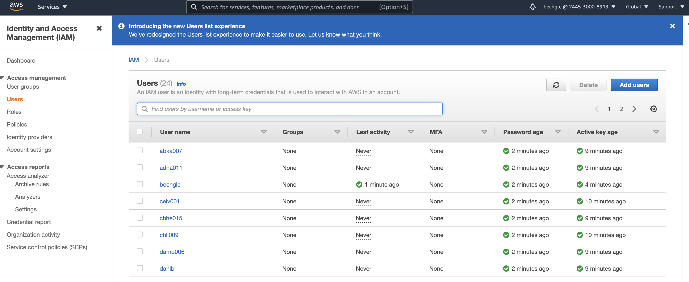
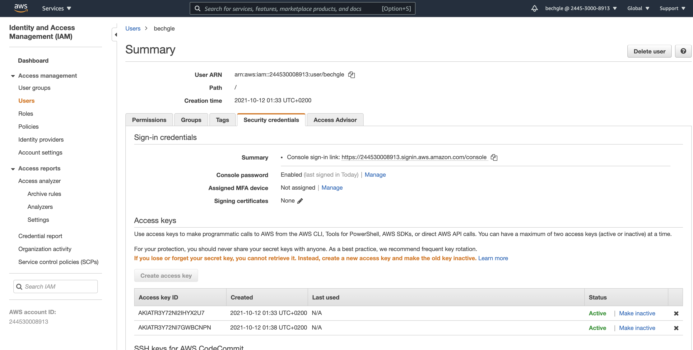

# Webapp og infrastruktur med React, Terraform og Open Source moduler

I denne øvingen skal du øve på 

* Mer avansert Github actions. For eksempel; Flere jobber og avhengigheter mellom jobber
* Mer avansert Github actions - Bruke funksjonen ```github.issues.createComment``` for å legge på kommentarer på Pull requests 
* Terraform i Pipeline - Terraform skal nå kjøres av GitHub actions
* Hvordan vi kan bruke GitHub Actions til å bygge & publisere en enkel React.js webapp
* AWS - Hvordan bruke en open source modul til å spare masse tid, og publisere en enkel React.js webapp
* 
## Sjekk tillgang til Cloud 9 miøjøet ditt.

* I klasserommet får du tilgang til et Cloud9 miljø. Sørg for at du har tilgang til dette 
* Før du starter må du kage dine egne AWS Aksessnøkler for din IAM bruker 

Gå til AWS fra Cloud 9


Gå til tjenesten IAM og finn din *egen bruker* (please)


* Lag nye nøkler (Create access Key)


Noter Access Key ID og Secret Access Key. Disse skal legges inn som Repo secrets i neste steg

## Legg til Github repository secrets

* Lag en fork av dette repoet
* Sjekk ut din fork i Cloud9 miljøet ditt med "git clone ...."
* Legg til "repository secrets", verdier gis i klasserommet. Dette gjorde vi i øving 5. Hvis du trenger repetisjon, sjekk her; <https://github.com/PGR301-2021/05-cd-apprunner-with-docker#gi-github-actions-tilgang-til-n%C3%B8kler>


## Oppgave 1

I provider.tf har vi en Backend for Terraform sin state basert på S3. 

### Husk

* State - mekanismen som Terraform bruker for koble infra-kode til faktisk infrastruktur 
* Backend. En lagringsplass for state filen. Hvis du ikke har noen backend konfigurasjon får du en .tfstate fil på maskinen din.

* I denne filen må må du endre på stien til terraform state filen, og bruke ditt unike filnavn, for eksempel min (glenn)

```hcl
  backend "s3" {
    bucket = "pgr301-2021-terraform-state"
    key    = "glennbech/terraform-in-pipeline.state"
    region = "eu-north-1"
  }
```
## Oppgave 2

Lag en variables.tf i rotkatalogen, og fjern hardkodingen av "glenn" i static_website.tf filen. Det er ikke god praksis å hardkode
verdier ("glenn") på denne måten. 

Legg også spesielt merke til hvordan vi referer til moduler på en veldig "kort form" når de finnes i Terraform registry (https://registry.terraform.io/)

```hcl
module "static-site" {
    source  = "telia-oss/static-site/aws"
    version = "3.0.0"
    
    hosted_zone_name = "thecloudcollege.com"
    name_prefix      = "glenn"
    site_name        = "glenn.thecloudcollege.com"
}
```

## Oppgave 3 

Modifiser filen ```.github/workflows/pipeline.yaml``` og tilpass denne ditt eget miljø. Vi skal se litt nærmere på denne filen, her er det ganske mye nytt

Vi sette miljøvariabler på denne måten slik at terraform har tilgang til AWS nøkler, og har de rettighetene som er nødvendig. 

```yaml
    env:
      AWS_ACCESS_KEY_ID: ${{ secrets.AWS_ACCESS_KEY_ID }}
      AWS_SECRET_ACCESS_KEY: ${{ secrets.AWS_SECRET_ACCESS_KEY }}
      AWS_REGION: eu-north-1
```

Her ser vi et steg i en pipeline med en "if" - som bare skjer dersom det er en pull request som bygges, vi ser også at 
pipeline får lov til å fortsette dersom dette steget feiler. 

```
      - name: Terraform Plan
        id: plan
        if: github.event_name == 'pull_request'
        run: terraform plan -no-color
        continue-on-error: true
```

Her setter vi en miljøvariable lik teksten som et tidligere steg skrev til stdout når det kjørte 

```yaml
       env:
          PLAN: "terraform\n${{ steps.plan.outputs.stdout }}"
```

Her brukers den innebyggede funksjonen  ```github.issues.createComment``` til å lage en kommentar til en Pull request, med innholdet av Terraform plan. Altså, hva kommer til å skje hvis vi kjører en apply på denne.

```yaml
  script: |
    const output = `#### Terraform Format and Style 🖌\`${{ steps.fmt.outcome }}\`
    #### Terraform Initialization ⚙️\`${{ steps.init.outcome }}\`
    #### Terraform Validation 🤖\`${{ steps.validate.outcome }}\`
    #### Terraform Plan 📖\`${{ steps.plan.outcome }}\`
    <details><summary>Show Plan</summary>
    \n
    \`\`\`\n
    ${process.env.PLAN}
    \`\`\`
    </details>
    *Pusher: @${{ github.actor }}, Action: \`${{ github.event_name }}\`*`;
    github.issues.createComment({
      issue_number: context.issue.number,
      owner: context.repo.owner,
      repo: context.repo.repo,
      body: output
    })
```

En fin måte å sjekke om bygget kjører som respons på en push til main, bare kjør apply (endre infrastrukturen)
på endring i main branch 

```yaml
      - name: Terraform Apply
        if: github.ref == 'refs/heads/main' && github.event_name == 'push'
        run: terraform apply -auto-approves
```

Student webapp trenger infrastrukturen laget av terraform. Vi kan da bruke "needs" for å lage en avhengighet mellom en eller flere jobber; 

```yaml
student_webapp:
    env:
      AWS_ACCESS_KEY_ID: ${{ secrets.AWS_ACCESS_KEY_ID }}
      AWS_SECRET_ACCESS_KEY: ${{ secrets.AWS_SECRET_ACCESS_KEY }}
      AWS_REGION: eu-north-1
    needs: terraform
```

Å publisere en statisk website, og hoste denne på AWS S3 gjøres i to steg; 

* npm build, som bygger et sett med statiske websider av applikasjonen 
* kopiering av disse filene til en S3 bucket 

For en grundig gjennomgang av hva som skjer i kulissene her; sjekk gjerne ut denne; https://medium.com/@p_stotz/static-website-hosting-leverage-aws-s3-with-cloudfront-route53-acm-and-lambda-edge-8c781bc3b390
Fordelen med Terraformmoduler er at vi kan komme raskt i gang uten nødvemdigvis å kunne alle detaljene. 

# Ekstra 

Følg tutorial for hvordan dere kan lage egne terraform moduler; https://learn.hashicorp.com/tutorials/terraform/module-create

